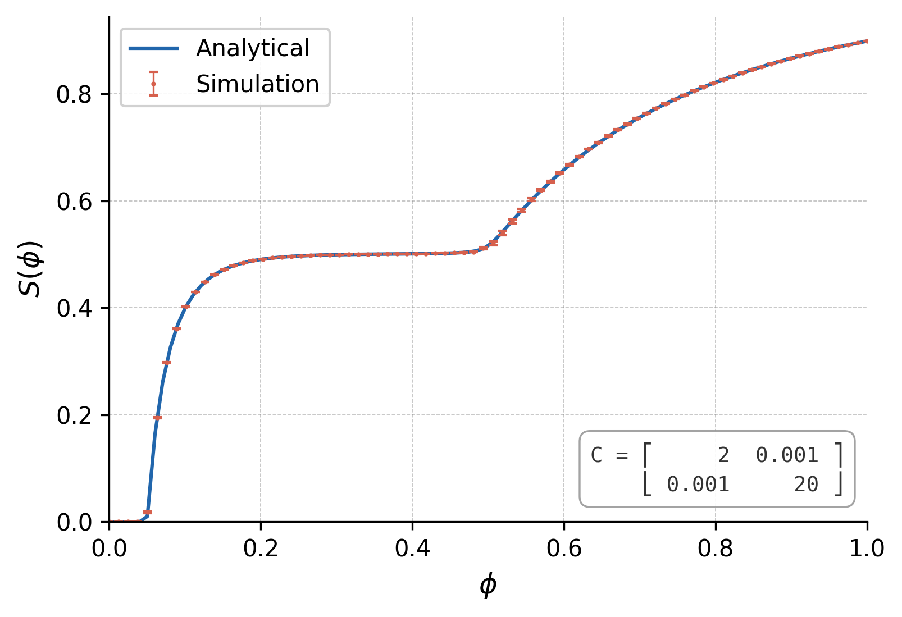
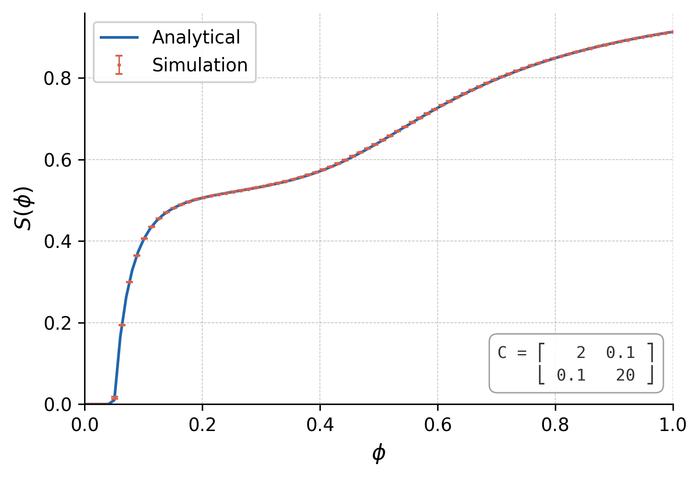

# Stochastic block model simulation

This repository contains code for creating stochastic block models and *microcanonical degree-corrected* stochastic block models in Rust, and an implementation of the fast edge percolation algorithm explained in https://arxiv.org/abs/cond-mat/0101295.
A python script is used to plot the results of the percolation algorithm, with the sizes of the giant cluster found solving the theoretical equations numerically.

