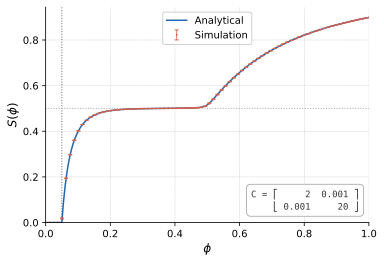
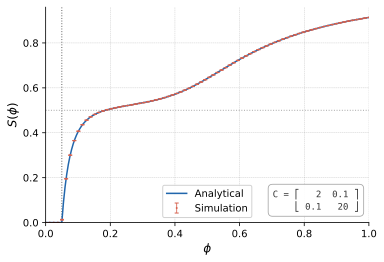
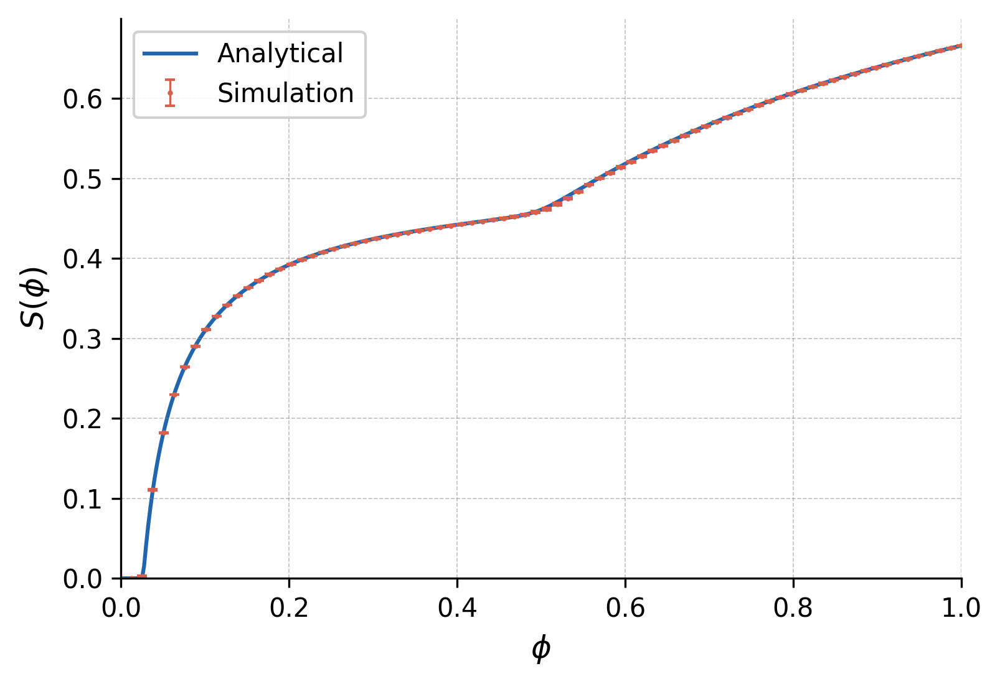
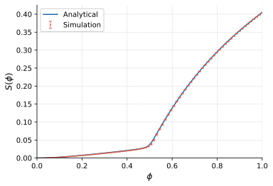
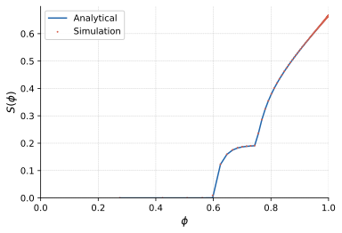
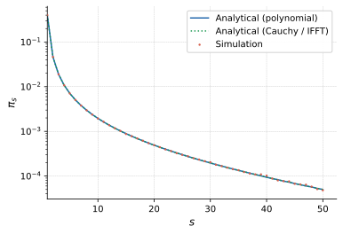

# Degree-Corrected Stochastic block model

This repository contains code for analyzing the giant component, edge-percolation, targeted percolation and small component sized for the degree-corrected stochastic block model, a new model of random graphs that generalizes the stochastic block model by allowing for arbitrary degree distributions within each block. The code is implemented in Rust, and Python scripts are used to plot the results.

There are four executables corresponding to four analyses:

## Edge percolation for stochastic block model

The first executable, `edge_percolation_sbm` implements the fast edge percolation algorithm explained in https://arxiv.org/abs/cond-mat/0101295, which allows us to find the size of the giant component as a function of the fraction of edges removed, for the standard and well-known stochastic block model.

## Edge percolation for degree-corrected stochastic block model

The second executable, `edge_percolation_dc_sbm` implements the same edge percolation algorithm for the degree-corrected stochastic block model, which allows us to find the size of the giant component as a function of the fraction of edges removed, for the more general degree-corrected stochastic block model.

The example is from a geometric degree distribution: $p_k^r = (1-a_r) a_r^k$, with $\vec{a} = (0.5, 0.95)$.

And here is an example with one small group made of 10% nodes with power law degree distribution with exponent 2.5, and one large group made of nodes with a geometric degree distribution with parameter $a=0.5$:

## Targeted percolation for degree-corrected stochastic block model

The third executable, `targeted_percolation_dc_sbm` implements a _targeted node percolation_ on the degree-corrected, a process where all nodes of degree higher than a certain threshold are removed, and we find the size of the giant cluster as a function of the nodes present.
Since there is no ambiguity when performing this process, a simple breadth-first search can be used to find the size of the giant cluster.

The example is from a degree corrected stochastic block model with the same parameters as before.

## Small component size distribution for degree-corrected stochastic block model

The fourth executable, `small_components` compares the numerical solutions (two approaches: computation of polynomial generating function and approximation using FFT) for the probability that a randomly chosen node belongs to a small component of size $s$ with the results obtained from simulations.

The example is from a geometric degree distribution: $p_k^r = (1-a_r) a_r^k$, with $\vec{a} = (0.4, 0.8)$.

