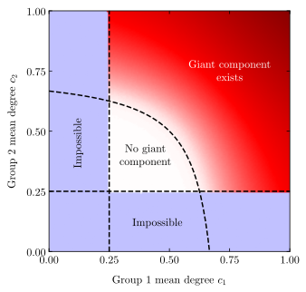
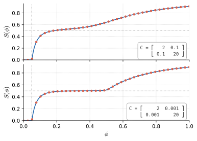
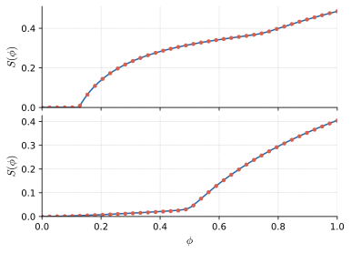
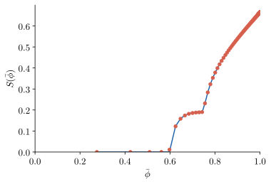
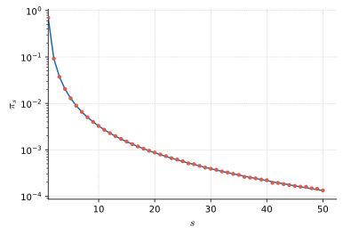

# Component structure and percolation in block models

This repository contains code for analyzing the giant component, edge-percolation, targeted percolation and small component sized for the microcanonical block model, a model of random graphs that generalizes the stochastic block model by allowing for arbitrary degree distributions within each group. 
The code is implemented in Rust, and Python scripts are used to plot the results.

There are five executables corresponding to four analyses:

## Giant component phase diagram for microcanonical block model

The first executable, `phasediag`, generates a phase diagram for the giant component in the microcanonical block model, as a function of the mean degree of each group. 
The network consists of $n=100 000$ nodes, subdivided into two groups of equal size, with geometric degree distributions $p_k^r = (1-a_r) a_r^k$, and the mixing parameter is set to $m_{12} = n/8$.

## Edge percolation for stochastic block model

The second executable, `edge_percolation_sbm` implements the fast edge percolation algorithm explained in https://arxiv.org/abs/cond-mat/0101295, which allows us to find the size of the giant component as a function of the fraction of edges removed, for the standard and well-known stochastic block model.

## Edge percolation for microcanonical block model

The third executable, `edge_percolation_dc_sbm` implements the same edge percolation algorithm for the microcanonical block model, where the degree of each node is specified.

*Top*: geometric degree distribution: $p_k^r = (1-a_r) a_r^k$, with $\vec{a} = (0.4, 0.8)$.
*Bottom*: a Network where 10% of the nodes belong too a group with power law degree distribution with exponent 2.5, and rest belong to a group with geometric degree distribution, with parameter $a=0.5$.
In both cases the mixing parameter is $m_{12}/\kappa_1 = 0.001$.

## Nonuniform occupation probability for microcanonical block model

The fourth executable, `targeted_percolation_dc_sbm` implements a _targeted node percolation_ on the microcanonical block model, a process where all nodes of degree higher than a certain threshold are removed, and we find the size of the giant cluster as a function of the nodes present.
Since there is no ambiguity when performing this process, a simple breadth-first search can be used to find the size of the giant cluster.

Geometric degree distribution: $p_k^r = (1-a_r) a_r^k$, with $\vec{a} = (0.5, 0.95)$ and mixing parameter $m_{12}/\kappa_1 = 0.001$.

## Small component size distribution for microcanonical block model

The fifth executable, `small_components` compares the numerical solutions for the probability that a randomly chosen node belongs to a small component of size $s$ with the results obtained from simulations.

The example is from a geometric degree distribution: $p_k^r = (1-a_r) a_r^k$, with $\vec{a} = (0.2, 0.4)$ and mixing parameter $m_{12}/\kappa_1 = 0.8$.

